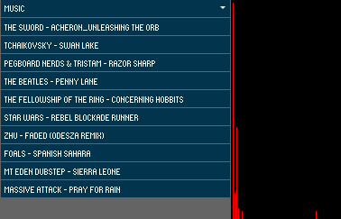
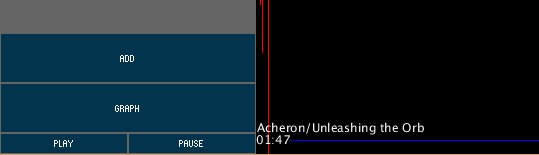
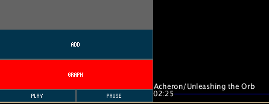
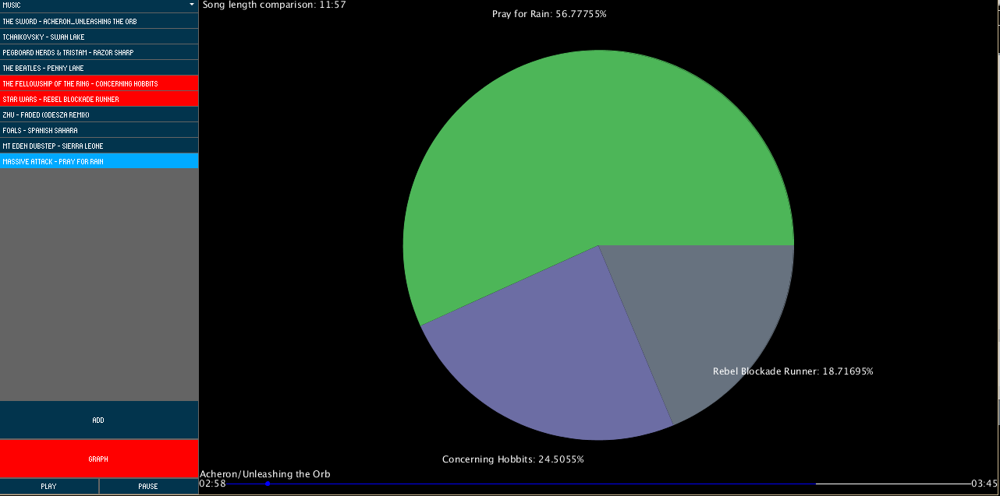

# Assignment_1
Ross Murphy C14341031
This program visualizes the waveform and frequency of songs as well as acts as a (terrible) media player. 
It also allows the user to compare the lengths of songs.

When the program stats it will play the first song on the dropdown list in the top left. If you click on one of the songs on the list it will switch to that song.

The bar at the bottom shows the current position of the player and allows the user to skip forward or backward through the song. The name of the song currently playing is also displayed just above this bar.

The "Play" and "Pause" buttons allow the user to pause and play the songs.

The "Add" button allow the user to add their own .mp3 songs to the list. The program will inform you that songs with metadata title set are preferred for the display of the pie chart.

The "Graph" button shows the user the pie chart clicking it again will return to the player. It will be initially blank, but selecting songs on the left will add it to the list and create the pie chart.

That’s about it the program is fairly simple and clear.
